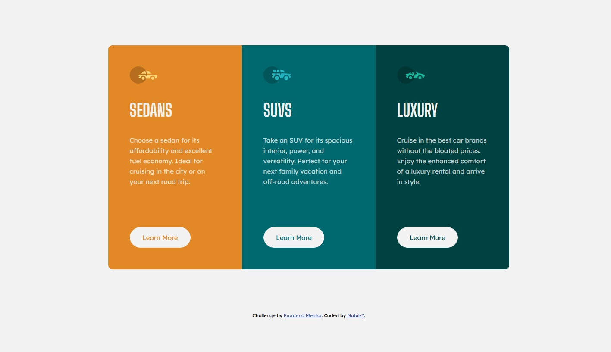
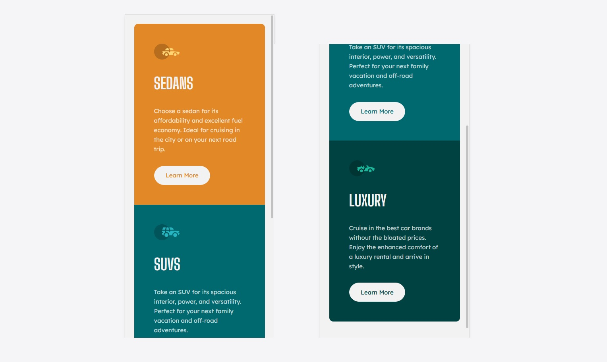

# Frontend Mentor - Stats preview card component solution

This is a solution to the [Stats preview card component challenge on Frontend Mentor](https://www.frontendmentor.io/challenges/stats-preview-card-component-8JqbgoU62). Frontend Mentor challenges help you improve your coding skills by building realistic projects. 

## Table of contents

- [Overview](#overview)
  - [The challenge](#the-challenge)
  - [Screenshot](#screenshot)
  - [Links](#links)
- [My process](#my-process)
  - [Built with](#built-with)
  - [What I learned](#what-i-learned)
  - [Continued development](#continued-development)
- [Author](#author)

## Overview

### The challenge

Users should be able to:

- View the optimal layout depending on their device's screen size
- See hover states for interactive elements

### Screenshot

### Links

[Live Preview](https://nabil-y.github.io/ThreeColumnCards/)

## My process

### Built with

- Semantic HTML5 markup
- CSS custom properties
- Grid
- Flexbox
- Responsive Design with media queries

### What I learned

- I have more experience with flexbox and responsive design
- Using grid and designing layouts with it 
- Putting to use the advice received after completing my two other projects

### Continued development

- I need to practice more especially grid, as it looks like an amazing tool
- First I tried to design a responsive grid with " grid-template-columns: repeat(auto-fit), minmax (240px,1fr);" but it wasn't working as intended. I should study more about that

## Author

- Frontend Mentor - [@Nabil-Y](https://www.frontendmentor.io/profile/Nabil-Y)

